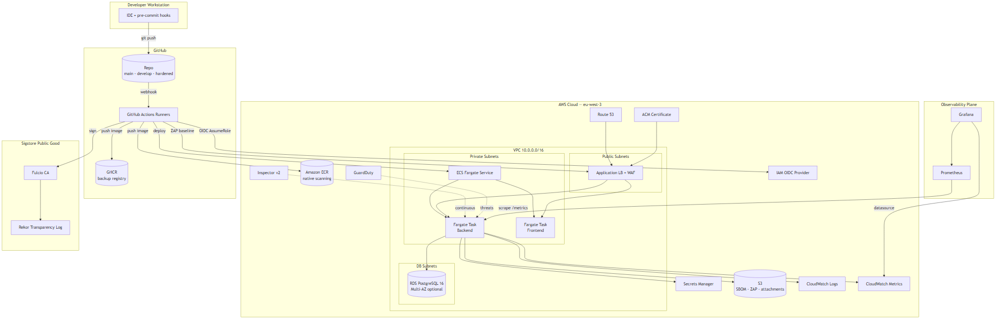
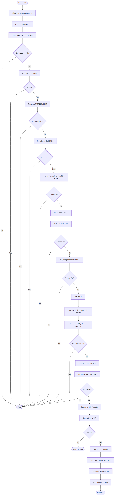

# AegisFlow

> **DevSecOps with a built-in shield** — a 22-stage secure CI/CD pipeline with
> AWS-native supply-chain enforcement, demonstrated end-to-end on a deliberately
> vulnerable web application that is hardened through pipeline-enforced
> remediation.

[](./.github/workflows/ci-pipeline.yml)
[]()
[]()
[]()
[]()
[]()
---

## Why AegisFlow

Most software organizations treat security as a post-development audit step.
**AegisFlow inverts that model**: security is enforced at every stage of the
delivery lifecycle, every build produces verifiable supply-chain artifacts, and
every deployment lands on AWS infrastructure provisioned by signed, scanned
Terraform.

The platform is built around a deliberately vulnerable demo application —
**SecureTrack**, an incident-reporting platform — that contains 15 intentional
security flaws (`V1`–`V15`). The pipeline catches all of them and blocks
deployment until each is remediated, producing a measurable
**30+ critical/high findings → 0** narrative.

---

## Table of Contents

- [Architecture](#architecture)
- [Security Controls](#security-controls)
- [Pipeline Stages](#pipeline-stages)
- [Cloud Infrastructure](#cloud-infrastructure)
- [Tech Stack](#tech-stack)
- [Quick Start](#quick-start)
- [Demo Application](#demo-application)
- [Vulnerability Catalogue](#vulnerability-catalogue)
- [Before vs After](#before-vs-after)
- [Documentation](#documentation)
- [Repository Structure](#repository-structure)
---

## Architecture

Full deployment topology — AWS-native, OIDC-federated, signed end-to-end:



Full diagram set: [`docs/diagrams/`](./docs/diagrams/) — MCD, use case, class,
sequence (×2), deployment, activity, component.

---

## Security Controls

| Control | Tool | Stage | Blocking |
|---------|------|-------|----------|
| Secret detection | Gitleaks | Pre-build | Yes |
| SAST | Semgrep (+ custom rules) | Build | Yes |
| Code quality | SonarCloud | Build | Yes |
| Dependency scan | Trivy + npm audit | Build | Yes |
| Dockerfile lint | Hadolint | Package | Yes |
| Image scan | Trivy + ECR native | Package | Yes |
| Policy-as-code | Conftest / OPA | Package | Yes |
| IaC scan | tfsec | Infrastructure | Yes |
| SBOM | Syft (SPDX) | Package | Advisory |
| Image signing | Cosign keyless (OIDC) | Package | Advisory |
| DAST | OWASP ZAP | Post-deploy | Advisory |
| Runtime CVE | Amazon Inspector v2 | Runtime | Continuous |
| Threat detection | Amazon GuardDuty | Runtime | Continuous |
| L7 protection | AWS WAF (OWASP CRS) | Edge | Continuous |

See [`docs/security-controls.md`](./docs/security-controls.md) for the full
inventory with control IDs and compliance mapping.

---

## Pipeline Stages

The CI/CD pipeline runs 22 stages with 5 explicit blocking gates:



See [`.github/workflows/ci-pipeline.yml`](./.github/workflows/ci-pipeline.yml)
for the implementation.

---

## Cloud Infrastructure

AegisFlow ships with a complete **Terraform module** that provisions the full
AWS landing zone for the application:

- **VPC** — three-tier subnets (public · private app · private DB) across two AZs
- **ECS Fargate** — serverless container runtime, no node management
- **ECR** — image registry with native vulnerability scanning
- **RDS PostgreSQL 16** — encrypted at rest, no public access, automated backups
- **ALB + AWS WAF** — L7 load balancing with OWASP Core Rule Set
- **ACM + Route 53** — auto-renewed TLS certificates and DNS
- **Secrets Manager** — DB credentials and JWT secret, IAM-scoped
- **S3** — versioned, encrypted bucket for SBOMs, scan reports, attachments
- **CloudWatch Logs + Metrics** — centralized observability
- **GuardDuty + Inspector v2** — runtime threat detection and continuous CVE scanning
- **IAM OIDC Provider** — GitHub Actions federation, **zero static AWS credentials**

The Terraform code is itself scanned by [`tfsec`](https://aquasecurity.github.io/tfsec)
in the pipeline.

See [`infrastructure/terraform/README.md`](./infrastructure/terraform/README.md)
for deployment instructions.

---

## Tech Stack

**Application**
- Backend: Node.js 20 + Express.js + Prisma ORM
- Frontend: React 18 + Vite + React Router
- Database: PostgreSQL 16

**DevSecOps Platform**
- CI/CD: GitHub Actions
- Registries: GitHub Container Registry (GHCR) + Amazon ECR
- Secret scan: Gitleaks
- SAST: Semgrep (community + custom rules)
- Code quality: SonarCloud
- SCA: Trivy + npm audit
- Container: Docker + BuildKit
- Dockerfile lint: Hadolint
- Image scan: Trivy + ECR native
- SBOM: Syft (Anchore) — SPDX format
- Signing: Cosign keyless (Sigstore)
- Policy-as-code: Conftest / OPA (Rego)
- IaC: Terraform
- IaC scan: tfsec
- DAST: OWASP ZAP
- Runtime security: Amazon Inspector v2, Amazon GuardDuty
- Observability: Prometheus + Grafana + CloudWatch

**Cloud (AWS)**
- Compute: ECS Fargate
- Database: RDS PostgreSQL
- Networking: VPC, ALB, WAF, Route 53, ACM
- Identity: IAM + GitHub OIDC federation
- Storage: S3
- Secrets: AWS Secrets Manager

---

## Quick Start

### Local development (without cloud)

```bash
git clone https://github.com/anlehtouf/AegisFlow-DevSecOps.git
cd AegisFlow-DevSecOps
chmod +x scripts/*.sh
./scripts/setup.sh

cd infrastructure
docker compose up -d
docker compose -f docker-compose.yml -f docker-compose.monitoring.yml up -d
```

Access points:
- Frontend: http://localhost:3000
- Backend: http://localhost:5000
- Prometheus: http://localhost:9090
- Grafana: http://localhost:3001 (admin/admin)

Default seeded credentials:
- Admin: `admin@securetrack.local` / `admin123`
- Reporter: `reporter@securetrack.local` / `reporter123`

### Cloud deployment (AWS)

```bash
cd infrastructure/terraform
cp terraform.tfvars.example terraform.tfvars   # edit values
terraform init
terraform plan
terraform apply
```

See [`infrastructure/terraform/README.md`](./infrastructure/terraform/README.md)
for full instructions including OIDC role setup.

---

## Demo Application

**SecureTrack** is an incident reporting and tracking platform:
- JWT-based authentication (register / login)
- Incident CRUD (create, list, view, update status)
- File attachments via S3 presigned URLs
- Role-based access (REPORTER, ADMIN, AUDITOR)
- Audit log of every mutation
- Health check and Prometheus metrics endpoints

See [`docs/architecture.md`](./docs/architecture.md) and the
[class diagram](./docs/diagrams/03-class-diagram.png) for details.

---

## Vulnerability Catalogue

The application starts with **15 intentional vulnerabilities** (marked `V1`–`V15`
in source comments), each detected by a specific tool in the pipeline:

| #  | Vulnerability | Detected By | Severity | OWASP Top 10 |
|----|--------------|-------------|----------|--------------|
| V1 | Hardcoded API key | Gitleaks | HIGH | A07 |
| V2 | Hardcoded JWT secret | Gitleaks + Semgrep | HIGH | A02 / A07 |
| V3 | SQL injection (raw query) | Semgrep | CRITICAL | A03 |
| V4 | XSS via `dangerouslySetInnerHTML` | Semgrep | HIGH | A03 |
| V5 | Vulnerable `lodash@4.17.20` | Trivy + npm audit | HIGH | A06 |
| V6 | Vulnerable `node:16` base image | Trivy image | HIGH/CRIT | A06 |
| V7 | Container runs as root | Hadolint + Conftest | MEDIUM | A05 |
| V8 | No HEALTHCHECK in Dockerfile | Hadolint + Conftest | LOW | A05 |
| V9 | Debug mode in error handler | Semgrep | MEDIUM | A05 |
| V10 | Missing helmet security headers | OWASP ZAP | MEDIUM | A05 |
| V11 | No rate limiting on auth | Semgrep (custom) + ZAP | LOW | A07 |
| V12 | Weak password policy | Semgrep (custom) | MEDIUM | A07 |
| V13 | Password logged to console | Semgrep (custom) | MEDIUM | A09 |
| V14 | CORS wildcard origin | Semgrep (custom) + ZAP | MEDIUM | A05 |
| V15 | Old Express version | Trivy | HIGH | A06 |

---

## Before vs After

| Metric | Before | After | Reduction |
|--------|--------|-------|-----------|
| Secrets in code | 2 | 0 | 100% |
| SAST high/critical | 6 | 0 | 100% |
| Vulnerable deps (critical) | 2 | 0 | 100% |
| Image critical CVEs | 15+ | 0 | 100% |
| Dockerfile lint errors | 3 | 0 | 100% |
| Policy violations | 2 | 0 | 100% |
| DAST high findings | 2 | 0 | 100% |
| **Total high/critical** | **30+** | **0** | **100%** |

---

## Documentation

- [Project Blueprint](./PROJECT_BLUEPRINT.md) — Complete specification (33 sections)
- [Diagrams](./docs/diagrams/) — MCD + UML pack (8 diagrams)
- [Architecture](./docs/architecture.md) — Technical architecture
- [Security Controls](./docs/security-controls.md) — Control inventory
- [Compliance Mapping](./docs/compliance-mapping.md) — OWASP SAMM, NIST SSDF, ISO 27001
- [Threat Model](./security/threat-model/threat-model.md) — STRIDE analysis
- [Runbook](./docs/runbook.md) — Operations guide
- [Terraform Module](./infrastructure/terraform/README.md) — AWS deployment

---

## Repository Structure

```
AegisFlow-DevSecOps/
├── .github/workflows/          GitHub Actions CI/CD pipelines
├── app/
│   ├── backend/                Node.js + Express API
│   └── frontend/               React + Vite SPA
├── security/
│   ├── gitleaks/               Secret scanning rules
│   ├── semgrep/                SAST custom rules
│   ├── trivy/                  Trivy configuration
│   ├── policies/               OPA / Rego policies
│   ├── zap/                    ZAP scan config
│   └── threat-model/           STRIDE threat model
├── infrastructure/
│   ├── docker-compose.yml      Local staging stack
│   ├── docker-compose.monitoring.yml
│   ├── prometheus/
│   ├── grafana/
│   └── terraform/              AWS landing zone (IaC)
├── scripts/                    Setup, deploy, health, reporting
├── docs/
│   ├── diagrams/               MCD + UML diagram pack
│   ├── architecture.md
│   ├── security-controls.md
│   ├── compliance-mapping.md
│   └── runbook.md
├── evidence/                   Screenshots and scan reports
├── reports/                    Generated scan outputs (gitignored)
└── README.md
```
